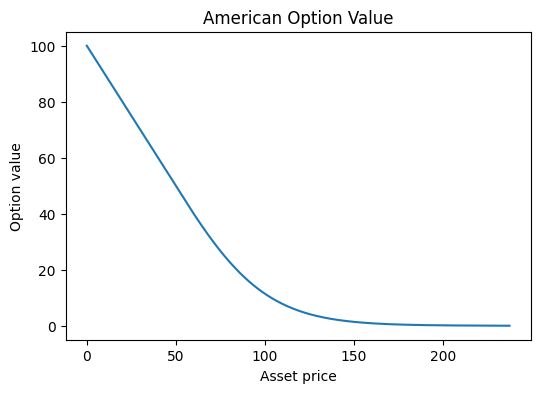
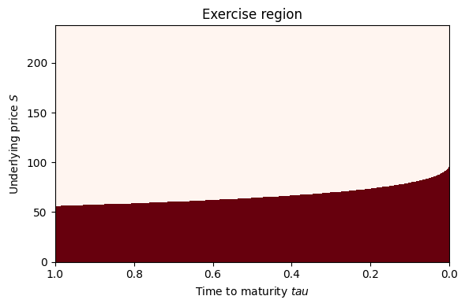
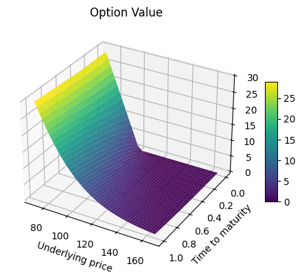
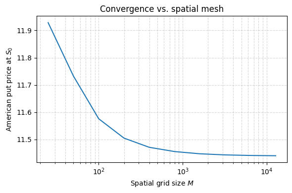

## American Options and Finite Difference Method
**Joaquin Garay**

As part of the course FRE 6233: Stochastic Calculus and Option Pricing

### Purpose

We consider an American put option with strike price $K$ and maturity $T$ under the Black-Scholes framework. The underlying asset price $S_t$ is assumed to follow a geometric Brownian motion under the risk-neutral measure $\mathbb{Q}$, described by the stochastic differential equation:

$$dS_t = r S_t dt + \sigma S_t dW_t$$

where $r$ is the risk-free interest rate, $\sigma$ is the volatility, and $W_t$ is a standard Brownian motion under $\mathbb{Q}$.

Our objective is to compute the value of the American put option and determine the early exercise boundary using the Finite Difference Method (FDM).

### Setup

The Finite Difference Method is a numerical technique for solving partial differential equations (PDEs). It works by discretizing both time and space, converting the continuous PDE into a system of algebraic equations. These equations can then be solved iteratively or directly to approximate the option value at each node of the discretized grid.

In the context of option pricing, FDM enables us to simulate the backward evolution of the option price over time, incorporating the early exercise feature inherent to American options by enforcing the free boundary condition at each time step.

The Obstacle PDE we work on reads as follows

$$
\min\{\frac{\partial u(x,\tau)}{\partial \tau} - \frac{\partial u(x,\tau)}{\partial x}\,(r-\delta)x-\frac{1}{2}\frac{\partial^2 u(x,\tau)}{\partial x^2} \sigma^2 x^2+ru(x,\tau), u(x,\tau)-(K-x)_+\} = 0, \quad\forall \tau (0,T], x\geq0
$$

where $\tau = T-t$ is the time to maturity.

#### The Mesh

We use an implicit scheme, so that the continuation PDE (first term of Obstacle PDE) reads as

$$\frac{u_i^{n+1} - u_i^n}{\Delta t} - \frac{u_{i+1}^{n+1} - u_i^{n+1}}{\Delta x}(r-\delta) x_i - \frac{1}{2}\frac{u_{i-1}^{n+1} - 2u_{i}^{n+1} + u_{i+1}^{n+1}}{(\Delta x)^2} \sigma^2 x_i^2 + ru_i^{n+1} = 0$$

Even though this scheme has only first-order precision, it is unconditionally monotone, thus its solution converges locally uniformly to the unique solution of the PDE (Barles-Souganidis Theorem).
$$u_i^n = u_{i-1}^{n+1} \underbrace{\left(-\frac{1}{2} \frac{\Delta t}{(\Delta x)^2} \sigma^2 x_i^2 \right)}_{a_i} + u_{i}^{n+1} \underbrace{\left(1+\frac{\Delta t}{\Delta x} (r-\delta)x_i + \frac{\Delta t}{(\Delta x)^2}\sigma^2 x_i^2 + r \Delta t \right)}_{b_i} + u_{i+1}^{n+1}\underbrace{\left(-\frac{\Delta t}{\Delta x}(r-\delta) x_i - \frac{1}{2} \frac{\Delta t}{(\Delta x)^2} \sigma^2 x_i^2\right)}_{c_i}$$

When written in matrix form we have
$$A_h\mathbf{u}_h^{n+1}  = \mathbf{u}_h^n$$
where

$$
\mathbf{u}_h^n =
\begin{bmatrix}
\vdots \\
u_{i-1}^n \\
u_i^n \\
u_{i+1}^n \\
\vdots
\end{bmatrix},
\quad
A_h =
\begin{bmatrix}
b_0 & c_0 & & & \\
\cdot & \cdot & \cdot & & \\
& \cdot & \cdot & \cdot & \\
& a_i & b_i & c_i & \\
& & \cdot & \cdot & \cdot \\
& & & a_M & b_M
\end{bmatrix}.
$$

So we create a uniform mesh of $M+1$ points in price space and $N+1$ in time space.

#### Boundary Conditions

We still have to define $b_0, c_0, a_M, b_M$ depending on the boundary conditions we impose on the discretization. The underlying price space will be discretized on a domain $[0,x^*]$, where $x^*$ is the price is
$$x^* = S_0 \exp\{(r-\tfrac{1}{2}\sigma^2)T + 3\sigma \sqrt{T}\}.$$
We know that $u(\tau, 0) = K$, and $u(\tau, x^*) = 0, \forall \tau$, so the vector $\mathbf{u}_h^n$ looks like

$$\mathbf{u}_h^n = \[K, \dots, u_{i-1}^n, u_i^{n}, u_{i+1}^n, \dots, 0\]^\top,$$

So, $b_0 = 1, c_0 = 0, a_M = 0, b_M = 0$.


#### Inverse of Martrix A

The Thomas algorithm is a simplified form of Gaussian elimination that efficiently solves linear systems where the coefficient matrix is tridiagonal — that is, a matrix where only the main diagonal and the two diagonals directly above and below it are non-zero.

Given a linear system:
$$Ax = b$$
where $A$ is a triagonal matrix.

The algorithm proceeds in two steps:
1. Forward elimination – transform to upper triangular.
2. Backward substitution – solve for $x$.

#### The code
$r=0.01, \delta = 0, \sigma = 0.2, K=100, T=1, S_0 = 100 $


```python
import numpy as np
import matplotlib.pyplot as plt

class FDM:
    def __init__(self,
                r: float,
                delta: float,
                sigma: float,
                K: float,
                T: float,
                S0: float,
                M: int,
                N: int,
                opt_type: chr):
        self.r, self.delta, self.sigma = r, delta, sigma
        self.K, self.T, self.S0 = K, T, S0
        self.M, self.N = M, N
        self.opt_type = opt_type

        # time & space steps
        self.delta_t = T / N
        self.x_top = S0 * np.exp((r - delta - 0.5*sigma**2)*T + 3*sigma*np.sqrt(T))
        self.delta_x = self.x_top / M

        # grid & payoff
        self.time = np.linspace(0, T, N)
        self.x = np.linspace(0, self.x_top, M)
        if (self.opt_type == 'P'):
            self.payoff = np.maximum(K - self.x, 0)
        else:
            self.payoff = np.maximum(self.x - K, 0)
        self.u = self.payoff.copy()   # initial condition at t = T

        # precompute diagonals
        self.a_vec = self._a()        # length M-1
        self.b_vec = self._b()        # length M
        self.c_vec = self._c()        # length M-1

        # decision Boundary
        self.free_bound = np.zeros((N,M))

    def _a(self):
        a = -0.5 * self.delta_t / self.delta_x**2 \
            * self.sigma**2 * self.x[1:]**2
        a[-1] = 0.0
        return a

    def _b(self):
        b = 1.0 \
            + self.delta_t / self.delta_x * (self.r - self.delta) * self.x \
            + self.delta_t / self.delta_x**2 * self.sigma**2 * self.x**2 \
            + self.r * self.delta_t
        b[0] = 1.0
        b[-1] = 1.0
        return b

    def _c(self):
        c = - self.delta_t / self.delta_x * (self.r - self.delta) * self.x[:-1] \
            - 0.5 * self.delta_t / self.delta_x**2 * self.sigma**2 * self.x[:-1]**2
        c[0] = 0.0
        return c

    def _thomas(self, a, b, c, d):
        """
        Solve tridiagonal system A x = d with:
          a = sub‑diag (len M-1), b = main‑diag (len M), c = sup‑diag (len M-1)
          d = RHS (len M)
        Returns x (len M).
        """
        M = len(b)
        # make copies so we don't overwrite originals
        bp = b.copy()
        dp = d.copy()
        cp = c.copy()

        # forward elimination
        for i in range(1, M):
            w = a[i-1] / bp[i-1]
            bp[i]   = bp[i]   - w * cp[i-1]
            dp[i]   = dp[i]   - w * dp[i-1]

        # back substitution
        x = np.zeros_like(d)
        x[-1] = dp[-1] / bp[-1]
        for i in range(M-2, -1, -1):
            x[i] = (dp[i] - cp[i] * x[i+1]) / bp[i]
        return x

    def run(self, early_exercise: bool = True):
        """
        Backward using Thomas solver on each step.
        """
        for _ in range(self.N-1):
            self.u = self._thomas(self.a_vec, self.b_vec, self.c_vec, self.u)
            if early_exercise:
                # mask = where payoff >= continuation -> we exercise
                mask = self.payoff >= self.u
                # record free boundary at this time‐step
                self.free_bound[_, mask] = 1
                # update u: exercise vs continue
                self.u = np.where(mask, self.payoff, self.u)
        self.free_bound[:,-1] = 0
        return self.u

    def get_price(self):
        return np.interp(self.S0, self.x, self.u)

    def get_free_bound(self):
        return self.free_bound

    def plot_free_bound(self):
        """
        Plot the exercise region as a heatmap.
        X–axis: underlying price (self.x)
        Y–axis: time (self.time)
        free_bound[t,i] == 1  ⇒ exercise
        """
        # make a meshgrid for plotting
        T, X = np.meshgrid(self.time, self.x, indexing='ij')
        plt.figure(figsize=(6,4))
        plt.pcolormesh(
            T, X,
            self.free_bound,
            shading='auto',
            cmap='Reds'
        )
        plt.xlabel('Time to maturity $tau$')
        plt.ylabel('Underlying price $S$')
        plt.title('Exercise region')
        plt.gca().invert_xaxis()
        plt.tight_layout()
        plt.show()

    def plot_value(self):
        plt.figure(figsize=(6,4))
        plt.plot(self.x, self.u)
        plt.xlabel('Asset price')
        plt.ylabel('Option value')
        plt.title('American Option Value')
        plt.show()

    def plot_value_surface(self, early_exercise: bool = True):
        X, Y = np.meshgrid(self.x[int(self.M*0.3):int(self.M*0.7)], self.time)
        u = np.zeros((self.N, self.M))
        u[0,:] = self.payoff.copy()

        for i in range(self.N-1):
            u[i+1,:] = self._thomas(self.a_vec, self.b_vec, self.c_vec, u[i,:])
            if early_exercise:
                u[i+1,:] = np.maximum(u[i+1,:],self.payoff)

        fig = plt.figure(figsize=(6, 4))
        ax = fig.add_subplot(111, projection='3d')
        surf = ax.plot_surface(X, Y, u[:,int(self.M*0.3):int(self.M*0.7)],
                               cmap='viridis', edgecolor='none')

        # 4. Add labels and color bar
        ax.set_title('Option Value')
        ax.set_xlabel('Underlying price')
        ax.set_ylabel('Time to maturity')
        fig.colorbar(surf, shrink=0.5, aspect=10)
        plt.gca().invert_yaxis()
        plt.tight_layout()
        plt.show()


```


```python
r=0.01
delta = 0.0
sigma=0.3
K=100
T=1.0
S0=100

solver = FDM(r=r,
             delta=delta,
             sigma=sigma,
             K=K,
             T=T,
             S0=S0,
             M=1000,
             N=1000,
             opt_type='P')

solver.run(early_exercise=True)
solver.plot_value()
solver.plot_free_bound()
print(f"Price of American Put Option: {solver.get_price():.4f}")
solver.plot_value_surface()
```


    

    


    

    


    Price of American Put Option: 11.4526


    

    


```python
M_list = [25, 50, 100, 200, 400, 800, 1600, 3200, 6400, 12800]
prices = []
for M in M_list:
    solver = FDM(r=r, delta=delta, sigma=sigma, K=K, T=T, S0=S0,
            M=M,
            N=1000,
            opt_type='P')

    solver.run(early_exercise=True)
    prices.append(solver.get_price())

plt.figure(figsize=(6,4))
plt.plot(M_list, prices)
plt.xscale('log')
plt.xlabel('Spatial grid size $M$')
plt.ylabel('American put price at $S_0$')
plt.title('Convergence vs. spatial mesh')
plt.grid(True, which='both', ls='--', alpha=0.5)
plt.tight_layout()
plt.show()

```


    

    


#### Analysis

The implicit scheme demonstrates **monotonic convergence** toward a stable value, as theoretically expected. From the option value surface, we observe how the function deforms near the singularity at the point $(0, K)$. This behavior aligns with known results: solutions to obstacle problems—often formulated as variational inequalities—tend to lack smoothness and may even be discontinuous at certain points. However, in this case, we do not observe additional visible singularities, such as along the free boundary, from visual inspection alone.
